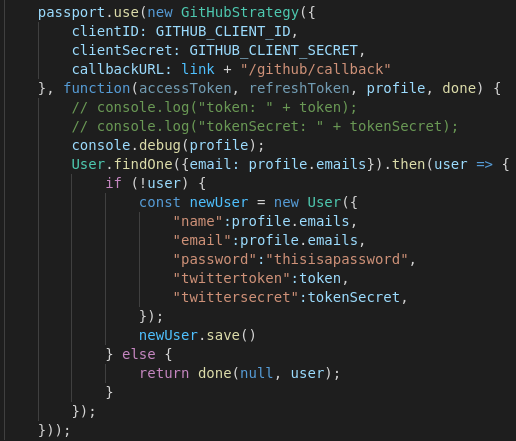
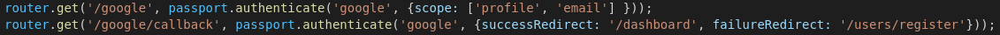
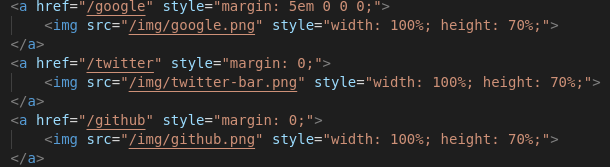
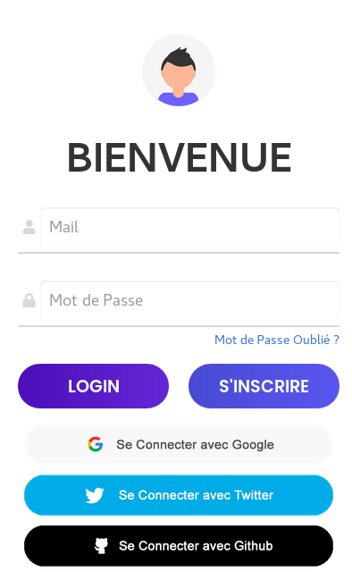
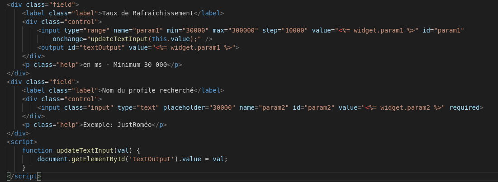
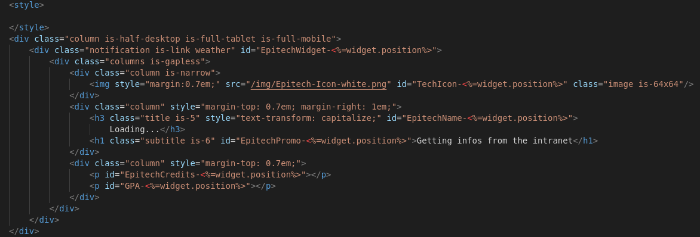
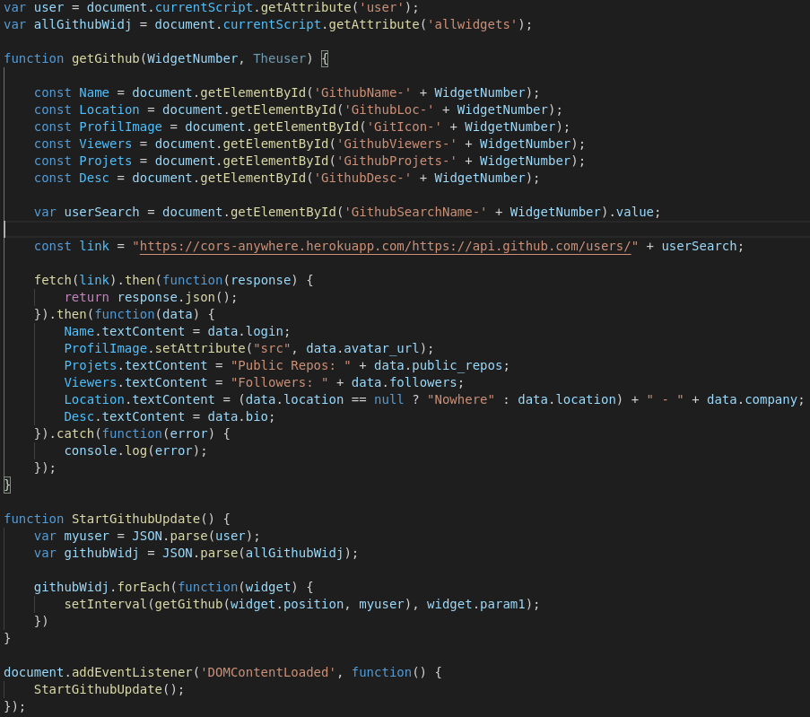
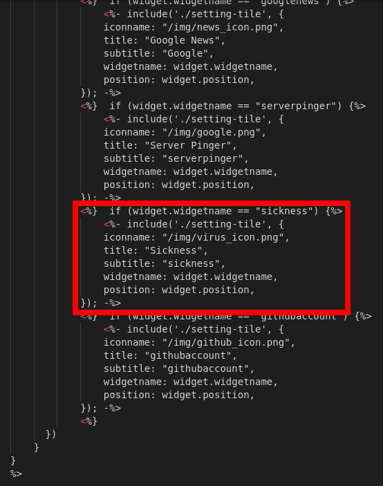
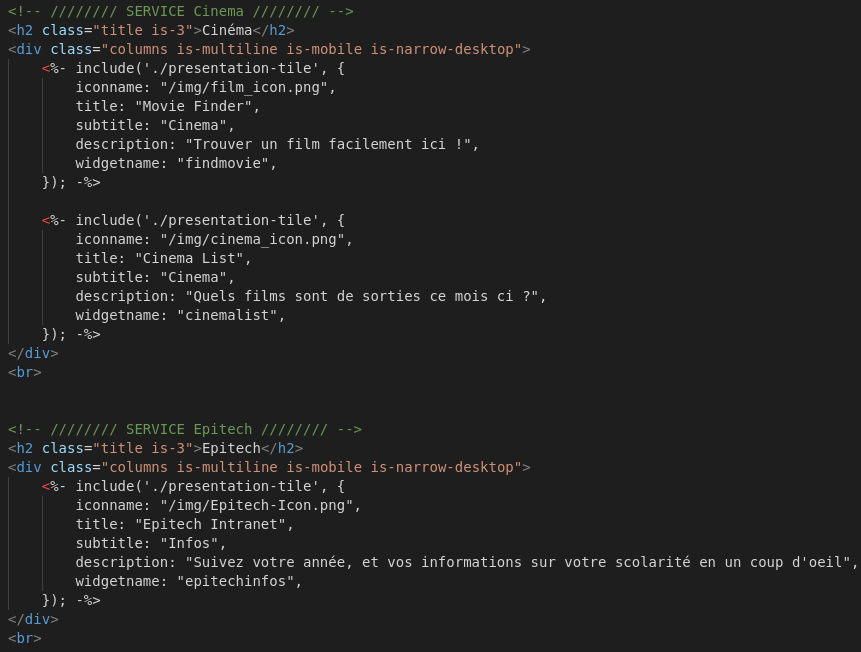
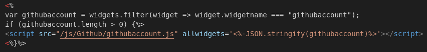

<h1>Documentation Technique de Dashboard:</h1>

<!-- Ajouter un system de connection au dashboard -->
***
<h2>Ajouter une connexion :</h2>
 
<table><thead><tr><th>Fichiers à modifier</th></tr></thead></table>

    -> config/passeport.js
    -> routes/index.js

    -> views/welcome.ejs
    -> views/login.ejs

 
<h4>Introduction</h4>

    Le dashboard accepte déjà les connexion et enregistrement avec Google, Github et Twitter. Il est aussi possible de créer un compte directement sur la plateforme.

<h4>Application</h4>

    Pour rajouter un systeme de connexion au dashboard, il vous faudra vraisemblablement commencer par créer une application sur la plateforme souhaité.

<h4>Passport</h4>

    Ceci étant fait, il vous faudra rajouter installer le passeport souhaité via

> npm install PASSPORT --save

    Une fois le passport installé, il vous faudra ajouter et modifier ce morceau de code au fichier "passport.js" dans le dossier config.

 

    Il vous faudra faudra principalement modifier la stratégie (ici "new GithubStrategy") par le keyword correspondant dans le node module téléchargé précedemment. Il vous faudra ensuite vous munirs de vos keys, ici GITHUB_CLIENT_ID et GITHUB_CLIENT_SECRET, et fournir l'url de redirection.

 

    La connection au compte se fait en fonction de l'email. dans la fonction "findOne" ci-dessus, il vous faudra donc récupérer l'email dans le json récupéré par a requète. Il vous faudra par la suite remplir le user nouvelement créer avec le plus d'informations possible.

 
<h4>index</h4>

    Une fois le passport fait, il faudra ajouter les routes pour accéder à ce system de connexion. Faites comme ci dessous en adaptant au system de connexion que vous souhaité ajouter.

    Ici, il faudra notamment remplacer "google" par le nom de votre réseau, service, ou entreprise.

> ATTENTION: Il faut laisser le successRedirect et le failureRedirect comme montrer ci-dessus.

    Le scope quant à lui variera rarement mais dépendra cela dit de votre system.

 
<h4>HTML Image et boutons</h4>

    Une fois tout ceci fait, veillez à ajouter une image ou un bouton pour pouvoir acceder à ce nouveau system de connexion. Pour ceci il vous faudra ajouter une balise href dans le fichier login.ejs.

<!-- Ajouter un widget au Dashboard -->
***
<h3>Ajouter un Widgets</h3>
 
<table><thead><tr><th>Fichiers à modifier</th></tr></thead></table>

    -> views/partials/widget-settings.ejs
    -> views/partials/widget-selection.ejs
    -> views/partials/widget-presentation.ejs

 
<table><thead><tr><th>Fichiers à créer</th></tr></thead></table>

    -> public/js/[WidgetName].js
    -> views/partials/Edit/edit-[WidgetName].ejs
    -> views/partials/Create/create-[WidgetName].ejs
 
<h4>Introduction</h4>

    Le fonctionnement basique du Dashboard repose sur la présence de widgets. Plus il y'en à mieux c'est !! Et vous pouvez nous y aider ! Pour commencer il vous faudra choisir un nom.

> ATTENTION: Le nom que vous choisirez sera EXTREMEMENT important. Pour la suite de l'ajout de widget remplacer scrupuleusement tout les "[WidgetName]" par le nom que vous aurez choisi.

<h4>Formulaire des paramètres</h4>

    Dans un premier temps, il vous faudra créer le form permettant de paramétrer votre widget. Pour cela il vous faudra créer le fichier "edit-[WidgetName].ejs" au path "views/partials/Edit/".

    Ajoutez y autant de champs que voulu, sous la forme choisi. Veillez cependant à TOUJOURS laisser le champs de rafraîchissement.

 

<h4>Design et Architecture du Widget</h4>

    Dans un second temps, il vous faudra créer le patterne de votre widget. Pour cela il vous faudra créer le fichier "create-[WidgetName].ejs" au path "views/partials/Create/".

    Ajoutez y autant de champs que souhaité, sous la forme choisi. Cela sera le design et l'architecture de votre widget. Faites attention aux id que vous choisissez pour vos composants.

 

<h4>La mise à jour des données au travers du script</h4>

    Une fois le patterne et le formulaire de votre widget créer, il vous faudra faire le script, qui servira à modifier et/ou alimenter votre widget en données.

    Voici un exemple si besoin.
    

 
<h4>La Liste des widgets</h4>

    Il vous faut ensuite ajouter votre widget à la liste.
    

    Ajouter donc un branchement de "if" en remplaçant par le nom de votre widget. Changez cependant l'icon et le title.

 
<h4>Page de présentation des Widget</h4>

    Il vous faut ensuite ajouter votre widget à la liste de la page de présentation. Si votre widget fait partie d'un service existant déjà, vous pouvez l'ajouter à la liste de ce service comme le service en haut de la photo ci-dessous.
    

    N'hésitez pas le cas échéant, à créer votre propre service, rien de plus simple. Dans ce cas faites comme le service du bas de la photo ci dessus.

 
<h4>Page de lien Widget-Script</h4>

    Pour terminer, il vous faut lier le script de votre widget, à votre widget. Pour cela rajouter un "if" comme la photo ci dessous.
    

 
<h4>Conclusion</h4>

    Maintenant, vous pouvez, une fois connectez sur le Dashboard accéder à votre nouveau widget.

